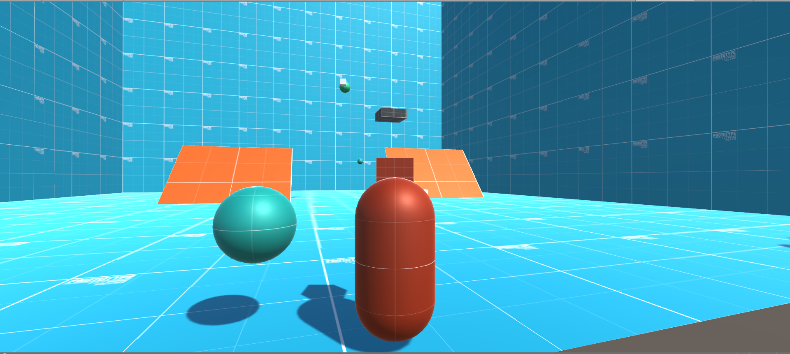
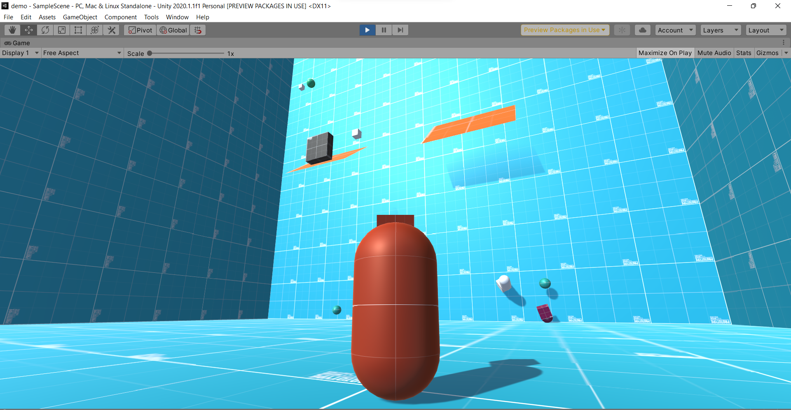
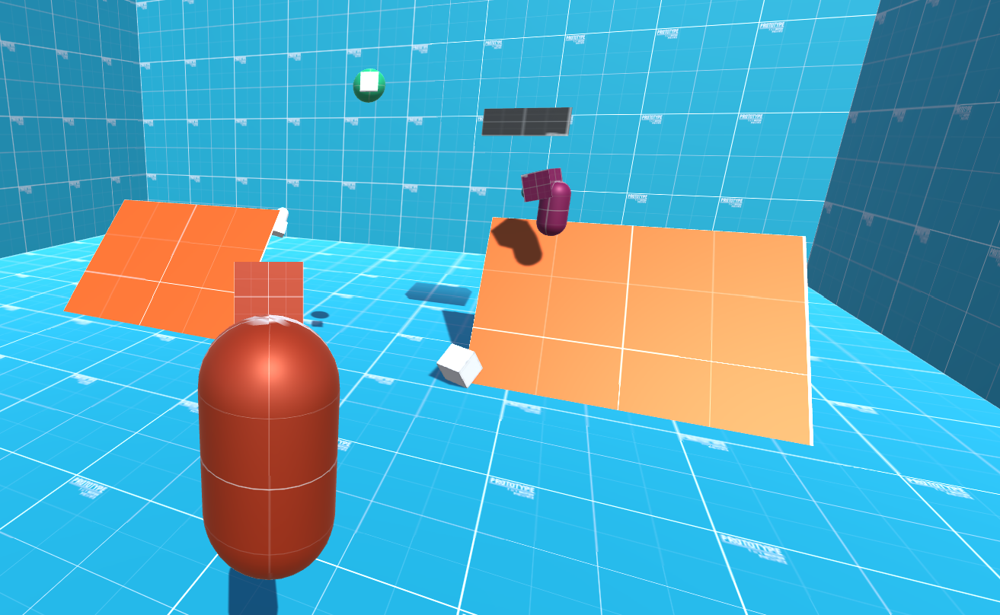

# The-Demo-Game

**Description:** This game is the my first experience with Unity.

**How to run projects:**

    git clone https://github.com/vuthanhtung2412/The-Demo-Game.git

    # Then open the repo with unity game engine

**Features:**
+ Duplicate movements.
+ Walk on walls, ceilling.
+ Change character orientation.

## Demos

